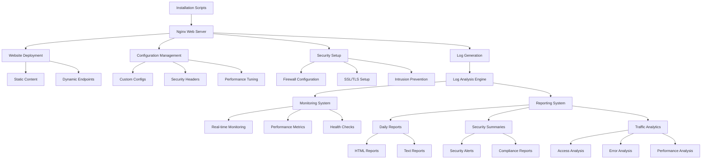
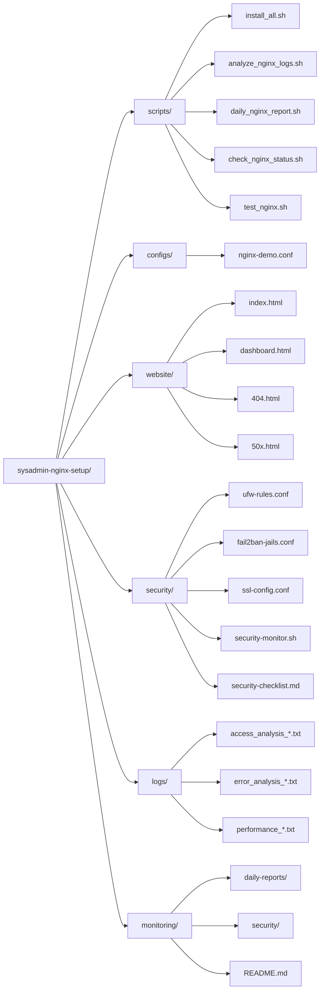
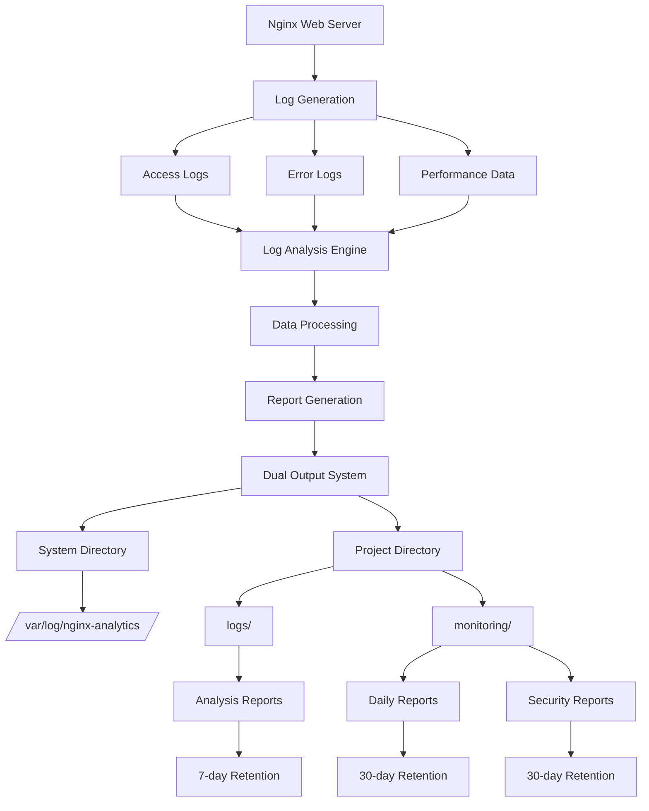

# Nginx Web Server Setup and Management System

## Overview

This project provides a comprehensive, enterprise-grade Nginx web server setup and management system designed for system administrators, DevOps engineers, and developers. It automates the complete lifecycle of Nginx deployment, from initial installation to ongoing monitoring and security management.

## System Architecture



## Project Structure



## Core Components

### 1. Installation and Setup
- **Automated Installation**: Complete Nginx setup with single command
- **System Configuration**: Optimized for Ubuntu/Debian systems
- **Service Management**: Systemd integration and auto-start configuration
- **Dependency Management**: Automatic package installation and updates

### 2. Web Server Configuration
- **Custom Nginx Config**: Production-ready server block configuration
- **Security Headers**: XSS, CSRF, clickjacking protection
- **Performance Tuning**: Gzip compression, caching, rate limiting
- **Error Handling**: Custom 404 and 50x error pages

### 3. Monitoring and Analytics
- **Real-time Monitoring**: Live service status and health checks
- **Log Analysis**: Comprehensive access and error log parsing
- **Performance Metrics**: CPU, memory, disk usage tracking
- **Traffic Analytics**: Visitor patterns, page popularity, IP analysis

### 4. Security Infrastructure
- **Firewall Setup**: UFW configuration with security rules
- **Intrusion Prevention**: Fail2ban integration for attack mitigation
- **SSL/TLS Management**: Self-signed certificate generation
- **Access Control**: File extension blocking, HTTP method restrictions

### 5. Automation and Reporting
- **Cron Integration**: Automated monitoring and report generation
- **Dual Output System**: Reports generated in both system and project directories
- **Data Retention**: Intelligent cleanup and storage management
- **Alert System**: Security event detection and notification

## Installation

### Prerequisites
- Ubuntu 20.04+ or Debian 11+
- Root/sudo privileges
- Internet connection for package downloads
- Minimum 1GB RAM and 2GB disk space

### Quick Start
```bash
# Clone the repository
git clone <repository-url>
cd sysadmin-nginx-setup

# Run complete installation
sudo ./install_all.sh

# Verify installation
sudo ./scripts/test_nginx.sh
```

### Manual Installation
```bash
# Step-by-step installation
sudo ./scripts/install_nginx.sh
sudo ./scripts/setup_website.sh
sudo ./scripts/configure_nginx.sh
sudo ./scripts/setup_monitoring.sh
sudo ./scripts/setup_security.sh
```

## Configuration

### Nginx Configuration
The system uses a custom Nginx configuration (`configs/nginx-demo.conf`) that includes:

- **Security Headers**: Comprehensive security protection
- **Rate Limiting**: DDoS protection and traffic control
- **Custom Logging**: Structured log formats for analysis
- **Error Pages**: Professional error handling
- **Health Endpoints**: `/health` and `/status` endpoints

### Security Configuration
- **UFW Firewall**: Network-level security rules
- **Fail2ban**: Intrusion detection and prevention
- **SSL/TLS**: Secure connection configuration
- **Access Control**: File and method restrictions

## Monitoring and Reporting

### Real-time Monitoring
```bash
# Check Nginx status
sudo ./scripts/check_nginx_status.sh

# Monitor security events
sudo ./security/security-monitor.sh

# Generate log analysis
sudo ./scripts/analyze_nginx_logs.sh
```

### Automated Reports
```bash
# Generate daily reports
sudo ./scripts/daily_nginx_report.sh

# View monitoring dashboard
# Access http://your-server/dashboard.html
```

### Report Types
- **Access Analysis**: Traffic patterns and visitor statistics
- **Error Analysis**: Server error monitoring and classification
- **Performance Analysis**: System resource utilization
- **Security Summary**: Security status and threat detection
- **Daily Reports**: Comprehensive 24-hour analysis

## Data Flow Architecture



## Security Features

### Network Security
- **Firewall Rules**: UFW configuration with security policies
- **Port Management**: Controlled access to essential services
- **Rate Limiting**: Protection against brute force attacks
- **IP Filtering**: Configurable access control lists

### Application Security
- **Security Headers**: Modern web security standards
- **Input Validation**: Request filtering and sanitization
- **File Access Control**: Dangerous file extension blocking
- **HTTP Method Restrictions**: Limited to essential methods

### SSL/TLS Security
- **Certificate Management**: Self-signed certificate generation
- **Cipher Configuration**: Strong encryption algorithms
- **HSTS Implementation**: HTTP Strict Transport Security
- **OCSP Stapling**: Certificate status verification

## Performance Optimization

### Nginx Tuning
- **Worker Processes**: Optimized process configuration
- **Connection Limits**: High concurrency support
- **Buffer Sizes**: Optimized memory allocation
- **Gzip Compression**: Reduced bandwidth usage

### System Optimization
- **Resource Monitoring**: CPU, memory, and disk tracking
- **Process Management**: Efficient service management
- **Log Rotation**: Automatic log file management
- **Cache Implementation**: Static content caching

## Maintenance and Operations

### Automated Tasks
```bash
# Set up cron jobs for continuous monitoring
crontab -e

# Add monitoring entries
0 * * * * /path/to/scripts/analyze_nginx_logs.sh
0 0 * * * /path/to/scripts/daily_nginx_report.sh
*/15 * * * * /path/to/security/security-monitor.sh
```

### Manual Maintenance
```bash
# Test Nginx configuration
sudo nginx -t

# Reload configuration
sudo systemctl reload nginx

# Check service status
sudo systemctl status nginx

# View real-time logs
sudo tail -f /var/log/nginx/nginx-demo-access.log
```

### Troubleshooting
- **Service Issues**: Comprehensive health check scripts
- **Configuration Errors**: Syntax validation and testing
- **Performance Problems**: Resource monitoring and analysis
- **Security Incidents**: Automated threat detection and response

## Integration Capabilities

### External Tools
- **Monitoring Systems**: Prometheus, Grafana integration ready
- **Log Aggregation**: ELK stack compatibility
- **CI/CD Pipelines**: Automated deployment support
- **Cloud Platforms**: AWS, Azure, GCP ready

### API Endpoints
- **Health Check**: `/health` endpoint for monitoring
- **Status Information**: `/status` endpoint for detailed status
- **Metrics Export**: Structured data for external systems
- **Configuration Management**: Runtime configuration updates

## Development and Testing

### Local Development
```bash
# Set up development environment
sudo ./scripts/install_nginx.sh
sudo ./scripts/setup_website.sh

# Test configuration changes
sudo nginx -t
sudo systemctl reload nginx

# Access development site
# http://localhost/
```

### Testing Framework
```bash
# Run comprehensive tests
sudo ./scripts/test_nginx.sh

# Test specific components
sudo ./scripts/check_nginx_status.sh
sudo ./security/security-monitor.sh
```

## Compliance and Standards

### Security Standards
- **OWASP Guidelines**: Web application security compliance
- **NIST Framework**: Cybersecurity framework alignment
- **PCI DSS**: Payment card industry standards (if applicable)
- **GDPR**: Data protection compliance (if applicable)

### Monitoring Standards
- **SLA Monitoring**: Service level agreement tracking
- **Performance Baselines**: Historical performance data
- **Security Metrics**: Threat detection and response times
- **Availability Tracking**: Uptime and reliability metrics

## Future Enhancements

### Planned Features
- **Real-time Dashboard**: Web-based monitoring interface
- **Email Alerting**: Automated notification system
- **Advanced Analytics**: Machine learning-based anomaly detection
- **API Management**: RESTful API for external integration
- **Multi-site Support**: Multiple domain management

### Scalability Improvements
- **Load Balancing**: Multiple server support
- **High Availability**: Failover and redundancy
- **Microservices**: Containerized deployment
- **Cloud Native**: Kubernetes and Docker support

## Support and Documentation

### Documentation
- **Installation Guide**: Step-by-step setup instructions
- **Configuration Reference**: Detailed configuration options
- **Troubleshooting Guide**: Common issues and solutions
- **API Documentation**: Integration and usage examples

### Community Support
- **Issue Tracking**: GitHub issues for bug reports
- **Feature Requests**: Community-driven development
- **Contributions**: Open source contribution guidelines
- **Discussions**: Community forums and discussions

## License

This project is licensed under the MIT License - see the [LICENSE](LICENSE) file for details.

## Contributing

We welcome contributions from the community. Please read our [Contributing Guidelines](CONTRIBUTING.md) for details on our code of conduct and the process for submitting pull requests.

## Acknowledgments

- **Nginx Team**: For the excellent web server software
- **Ubuntu/Debian**: For the robust Linux distribution
- **Open Source Community**: For the tools and libraries used
- **Contributors**: For their valuable contributions and feedback

---

**Last Updated**: August 2025  
**Version**: 1.0.0  
**Maintainer**: System Administration Team
