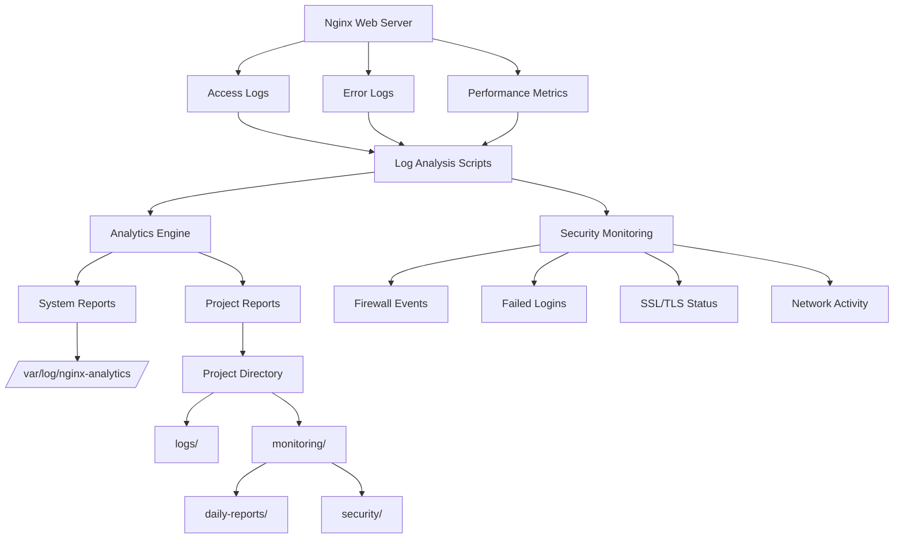
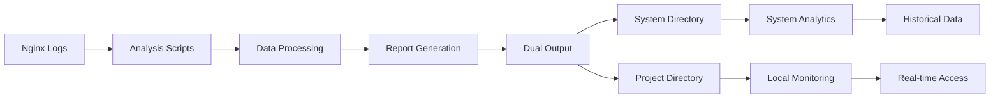

# Nginx Monitoring System

## Overview

The Nginx Monitoring System is a comprehensive monitoring and analytics solution designed to provide real-time insights into web server performance, security, and traffic patterns. This system automatically generates detailed reports and maintains historical data for system administrators and DevOps teams.

## System Architecture



## Directory Structure

```
monitoring/
├── README.md                           # This documentation
├── access_analysis_*.txt              # Access log analysis reports
├── error_analysis_*.txt               # Error log analysis reports
├── performance_*.txt                  # Performance metrics reports
├── daily-reports/                     # Daily comprehensive reports
│   ├── daily_report_*.html           # HTML formatted daily reports
│   └── daily_report_*.txt            # Text formatted daily reports
└── security/                          # Security monitoring reports
    └── security-summary_*.txt        # Security status summaries
```

## Generated Reports

### 1. Access Log Analysis
- **File Pattern**: `access_analysis_YYYYMMDD_HHMM.txt`
- **Content**: Total requests, hourly distribution, popular IP addresses, top pages, HTTP status codes, user-agent analysis
- **Frequency**: Generated on demand or via cron scheduling

### 2. Error Log Analysis
- **File Pattern**: `error_analysis_YYYYMMDD_HHMM.txt`
- **Content**: Error counts, critical errors (5xx), error types, hourly error distribution
- **Frequency**: Generated on demand or via cron scheduling

### 3. Performance Analysis
- **File Pattern**: `performance_YYYYMMDD_HHMM.txt`
- **Content**: Nginx process count, memory usage, CPU utilization, disk usage metrics
- **Frequency**: Generated on demand or via cron scheduling

### 4. Daily Reports
- **File Pattern**: `daily_report_YYYYMMDD.*`
- **Formats**: HTML and plain text
- **Content**: Comprehensive daily statistics including visitor analysis, page popularity, performance metrics, and security events
- **Frequency**: Generated daily at midnight

### 5. Security Monitoring
- **File Pattern**: `security-summary_YYYYMMDD_HHMMSS.txt`
- **Content**: Failed login attempts, firewall status, Fail2ban status, SSL/TLS health, network activity monitoring
- **Frequency**: Generated on demand or via cron scheduling

## Data Flow



## File Retention Policy

- **Analysis Reports**: 7 days retention
- **Daily Reports**: 30 days retention
- **Security Logs**: 30 days retention
- **Performance Data**: 7 days retention

## Automation

The system is designed to work with cron jobs for automated monitoring:

```bash
# Example cron entries
0 * * * * /path/to/scripts/analyze_nginx_logs.sh
0 0 * * * /path/to/scripts/daily_nginx_report.sh
*/15 * * * * /path/to/security/security-monitor.sh
```

## Integration Points

- **Nginx Configuration**: Monitors custom log formats and error handling
- **System Services**: Integrates with UFW firewall and Fail2ban
- **SSL/TLS**: Monitors certificate expiration and SSL errors
- **Network**: Tracks listening ports and active connections

## Usage Examples

### Manual Report Generation
```bash
# Generate log analysis
sudo ./scripts/analyze_nginx_logs.sh

# Generate daily report
sudo ./scripts/daily_nginx_report.sh

# Run security monitoring
sudo ./security/security-monitor.sh
```

### Automated Monitoring
```bash
# Set up cron jobs for continuous monitoring
crontab -e

# Add monitoring entries
0 * * * * /path/to/scripts/analyze_nginx_logs.sh
0 0 * * * /path/to/scripts/daily_nginx_report.sh
*/15 * * * * /path/to/security/security-monitor.sh
```

## Monitoring Metrics

### Performance Indicators
- Request throughput and response times
- Resource utilization (CPU, memory, disk)
- Process health and availability
- Error rates and types

### Security Indicators
- Authentication failures
- Firewall events and blocked connections
- SSL/TLS certificate health
- Network anomaly detection

### Traffic Analysis
- Visitor patterns and geographic distribution
- Page popularity and content performance
- User agent analysis and bot detection
- Referrer tracking and traffic sources

## Maintenance

### Log Rotation
- Automatic cleanup of old reports
- Configurable retention periods
- Disk space management

### Performance Optimization
- Efficient log parsing algorithms
- Minimal system resource usage
- Asynchronous report generation

## Troubleshooting

### Common Issues
1. **Permission Errors**: Ensure scripts have execute permissions
2. **Missing Logs**: Verify Nginx log file paths
3. **Disk Space**: Monitor analytics directory size
4. **Cron Failures**: Check system logs for execution errors

### Debug Mode
Enable verbose logging by modifying script log levels or adding debug flags.

## Future Enhancements

- Real-time dashboard integration
- Email alerting system
- Advanced anomaly detection
- Machine learning-based traffic analysis
- API endpoints for external monitoring tools
